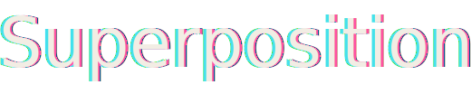
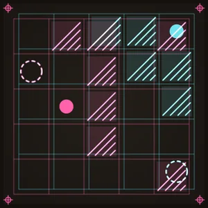

<p align="center">
  
</p>

<p align="center"><em>A two-layer puzzle: two pawns, one input.</em></p>

You move the cyan pawn and the magenta pawn **at the same time**, with a single
gesture, and you have to land each one on its own target. One arrow key, swipe,
or button drives both worlds — the whole puzzle is that they don't react the
same way.

<p align="center">
  
</p>

<p align="center"><sub>The last level, <em>Tectonique</em>, played out by the solver: moves, world drift (<code>decalage</code>), fusion (the pawns overlap to white), scission, then the amber lock — "ready to print".</sub></p>

A React web game running on TanStack Start, fully playable in the browser. The
core game is client-only; the optional **daily mode** (accounts, shared board,
leaderboard) is the one part that talks to a server.

## The idea

The same input acts on both layers at once. The difficulty comes from the two
worlds not behaving identically: each layer has its own walls, the planes can be
offset from one another, the two pawns can merge into one, and so on. Solving a
board means finding the sequence of inputs that satisfies both constraints
simultaneously.

## Mechanics

Each mechanic is a self-contained file in `src/engine/mechanics/`, switched on
per board through the level's `mods` list.

| Id         | Effect                                                                                                    |
| ---------- | --------------------------------------------------------------------------------------------------------- |
| `fusion`   | When `a == b + off`, the two pawns merge; the merged pawn passes through ink walls — only light stops it. |
| `scission` | From the merged state: cyan goes in the chosen direction, magenta goes the opposite way.                  |
| `lumiere`  | White squares block only the merged pawn; the inks pass straight through them.                            |
| `glace`    | Every move slides until it hits an obstacle (a layer wall or the edge).                                   |
| `decalage` | Slides layer B by one cell under the pawns; the two worlds must end up aligned.                           |
| `verso`    | The magenta film is laid emulsion-down: layer B reads horizontal pushes mirrored (left ↔ right).          |
| `repere`   | Registration pins fixed to the glass: an ink ending its move on one snaps the offset a notch toward zero. |

## Architecture

The engine guarantees state that is **finite, discrete, deterministic, and
hashable**: no randomness during play, no real time, no hidden information. The
direct consequence is that the game and the solver consume exactly the same API
(`successors` / `isWin` / `hashState`), so they cannot drift apart.

| Path                                    | Purpose                                                                              |
| --------------------------------------- | ------------------------------------------------------------------------------------ |
| `src/engine/types.ts`                   | The contract: the game state and the mechanic protocol                               |
| `src/engine/{grid,state,successors}.ts` | Geometry, lifecycle, move enumeration                                                |
| `src/engine/mechanics/`                 | One mechanic = one file + `registry.ts`                                              |
| `src/engine/levels.ts`                  | The level bank (pure data, 22 boards)                                                |
| `src/solver/`                           | Rule-agnostic BFS + the `verify` / `gen` CLIs                                        |
| `src/ui/screens/`                       | The title / select / play screens                                                    |
| `src/ui/components/`                    | Board, InkLayer, RegMark, Wordmark, Hud, Controls…                                   |
| `src/ui/hooks/`                         | `useGame`, `useSound`, `useKeyboard`, `useSwipe`, `useBestScores`                    |
| `src/routes/`                           | TanStack Start file-based routes (single `/` mounts the game; `api/` for daily mode) |
| `src/db/`                               | Postgres + Drizzle: schema, client, `drizzle.config.ts`, `migrations/`               |
| `src/lib/`                              | Better Auth setup (email + password)                                                 |
| `project.inlang/messages/{fr,en}.json`  | i18n catalogue (translation source, inlang format)                                   |

Data flow: input (keyboard / swipe / buttons) → `useGame.play` →
`engine.applyInput` → new state → render.

This repo is a TanStack Start (React 19 + Vite + Nitro) shell around the
original game. SSR is disabled app-wide — the game needs `AudioContext`,
`localStorage`, and keyboard/swipe — so the core loop is client-only. See
`AGENTS.md` for the full port history and toolchain notes.

## Getting started

Requires [Bun](https://bun.sh).

```sh
bun install
bun run dev       # Vite dev server on :3000
```

That is enough to play. For the **daily mode** (accounts + leaderboard) you also
need Postgres and a couple of secrets:

```sh
cp .env.example .env      # then fill BETTER_AUTH_SECRET (openssl rand -base64 32)
docker compose up -d      # local Postgres from docker-compose.yml
bun run db:migrate        # apply migrations to the database
```

## Commands

```sh
bun run dev          # dev server
bun run build        # paraglide + tsc typecheck + vite build
bun run test         # Vitest suite (engine only)
bun run lint         # oxlint
bun run verify       # certify every board in the bank is solvable (via the solver)
bun run gen          # hunt for new boards
bun run gen:daily    # generate the daily board
bun run db:generate  # emit a Drizzle migration from the schema
bun run db:migrate   # apply migrations
```

Run a single test: `bunx vitest run src/engine/state.test.ts`.

Generate boards with constraints:

```sh
bun run gen -- --mods fusion,scission --size 5 --min 18 --ms 30000
```

## The solver

`src/solver/` holds a completely rule-agnostic BFS: it only ever touches
`successors` / `isWin` / `hashState`. It powers two tools:

- `verify` — guarantees no board in the bank is unsolvable (part of the
  definition of done);
- `gen` — explores the level space to find new boards that genuinely require the
  requested mechanics.

## Internationalisation

Every displayed string goes through a key in `project.inlang/messages/{fr,en}.json`
and is read as `m.key()` (Paraglide). `src/paraglide/` is generated (git-ignored)
and regenerated on build, or by hand with `bun run paraglide`. The default
language follows the browser, with a French fallback.

## Adding content

- **A mechanic**: a file in `src/engine/mechanics/`, an entry in `registry.ts`,
  its id in `MechanicId` (`types.ts`), tests in `mechanics.test.ts`, then
  `bun run gen` to prove it is needed by a board.
- **A board**: an entry in `levels.ts`, a `hint_<id>` key in both languages, the
  entry in `src/ui/copy.ts`, then `bun run verify` must stay green.

## Art direction — "The light table"

The screen-printing workshop, the night before the run: two films (cyan,
magenta) laid on the backlit box. The dark background is a place, not a theme.

Tokens (`@theme` in `src/index.css`):

| Role                   | Value                 | Use                                                        |
| ---------------------- | --------------------- | ---------------------------------------------------------- |
| room                   | `#14110E`             | the workshop bakelite, global background                   |
| box / box-glow         | `#1B1713` / `#241F19` | light-box surface and halo                                 |
| ink-cyan / ink-magenta | `#45E0EC` / `#FF4FA3` | the two inks, `screen` blend                               |
| paper                  | `#F2EDE4`             | text — never `#fff`                                        |
| tape                   | `#E8B84B`             | masking tape: a RARE accent (armed states, stamp, records) |

Type: Instrument Serif italic for names and the wordmark (printed twice, badly
registered); the system monospace for data.

Signature element: the **registration marks** in the four corners of the board.
Doubled cyan/magenta, their misalignment visualises the offset between the
worlds (the `decalage` mechanic); they turn white on fusion and lock to amber on
"ready to print".

Sensory signatures (one per verb — sound + haptics + visual): a block is a
recoil of the box plus a 95 Hz thump; fusion is a white bloom plus two sine
waves converging to unison; scission is a diverging chord; decalage is a 62 Hz
rumble with inertia; glace is an ink trail with a glissando. Golden rule: every
effect is a legible consequence of the game state — nothing decorative.

`prefers-reduced-motion` is respected globally.
